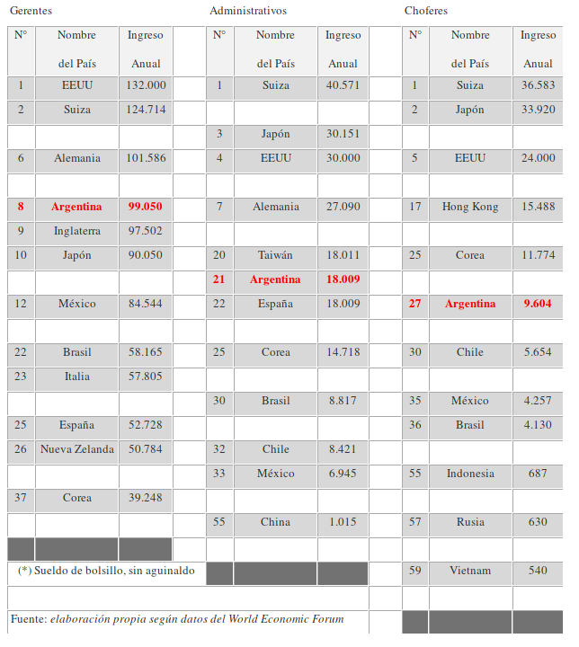

%include: header.inc

# CORRUPCION versus COMPETITIVIDAD

**RODOLFO ARLAND**  
Correo:  <rarland@supernet.com.ar>  
Argentina

## Introducción

A comienzos de esta década la Argentina encaró un ambicioso programa de reformas
económicas. Los lineamientos generales de la nueva política económica adoptada
se fundaron en la idea de que la crisis económica, en general, y la inflación,
en particular, estaban originadas en la sobrecarga fiscal que se producía como
consecuencia del déficit presupuestario, las excesivas regulaciones estatales y
la acción del "estado de bienestar" todo esto como resultado de la gran
intervención estatal en la economía.

El principal objetivo de las reformas económicas encaradas por el gobierno del
Presidente Menem fue erradicar las causas de los desequilibrios macroeconómicos
a través de medidas tales como la privatización de empresas públicas, la
desregulación de los mercados, la eliminación de subsidios estatales, en
síntesis, la apertura de la economía. El resultado de la nueva política
económica fue una drástica reducción de la inflación y una marcada recuperación
del crecimiento económico.

Este proceso de reformas económicas generó fuertes expectativas sobre la
posibilidad de crear condiciones que permitieran, si no erradicar, por lo menos
acotar un factor claramente incompatible con la economía de mercado y con un
gobierno que asegurara, por fin, transparencia, seguridad jurídica y
distribución equitativa del ingreso. Sin embargo, la conversión del presidente
en un candidato a ser re-reelecto y de su ex ministro de economía en candidato a
presidente (y, con ello, en crítico acérrimo de la gestión de gobierno)
disminuyó la velocidad de las reformas hasta casi detenerlas. Se dio así la
característica del agotamiento de un ciclo económico exitoso que, por su propia
dinámica, empezó a funcionar en "piloto automático" como consecuencia del fin de
la etapa de las reformas "difíciles de hacer" pero "simples de ejecutar".

El apoyo inicial de la sociedad a la primera etapa de reformas económicas (que
se tradujo en 1995 en la cómoda reelección del presidente que las impulsó) hoy
se ha reducido considerablemente. La imagen positiva del presidente atraviesa
hoy un nivel crítico, ubicándose alrededor del 10%. Sin duda que hay fatiga del
programa económico y, en democracia, esto es preocupante por cuanto la duración
de las reformas orientadas al mercado depende de los votantes que las apoyen.

Los desafíos políticos más complejos se producen después de lanzar las reformas
iniciales. Una vez reformado el régimen comercial, abierto el mercado de
capitales, privatizado las empresas públicas, es necesario modernizar la
legislación laboral, reestructurar el sistema de educación superior, establecer
marcos regulatorios para controlar las empresas públicas privatizadas y, en
definitiva, concensuar medidas con el resto de los actores políticos y
económicos. Se impone encarar la segunda etapa de reformas económicas tratando
de superar las consecuencias políticas negativas de la primera.

Para enfrentar los desafíos de estas reformas de segunda generación se impone el
fortalecimiento de las instituciones del régimen democrático argentino. La
cuestión radica en cómo gobernar conciliando la participación de los ciudadanos
con la capacidad de responder a sus necesidades de manera más eficaz. A
diferencia de la primera etapa, donde el actor principal fue el ejecutivo (el
presidente y sus ministros), en la segunda etapa aparece la burocracia estatal
en todos sus niveles, el congreso, el poder judicial, las provincias, los
municipios, los partidos políticos y la sociedad civil en general.

Los organismos multilaterales de crédito sugieren algunas condiciones muy
generales como las más adecuadas en el contexto de la segunda etapa de reformas.
Así el Banco Mundial sostiene que es imprescindible la existencia de leyes bien
orientadas y medios eficaces para su aplicación. Esto se traduce en reglas
claras de juego, reducción de los costos de transacción, consolidación de un
entorno comercial más seguro (especialmente el marco jurídico), creación de
incentivos a la eficiencia y combate a la delincuencia y la corrupción.

Los cientistas políticos, en general, consideran muy importantes ciertos grados
institucionales tales como el grado de responsabilidad del poder ejecutivo ante
el congreso, la estructura de ambos y sus relaciones, la proporcionalidad del
sistema electoral, la organización del poder político (centralista o federal) y
la participación efectiva de la sociedad civil en el control de la corrupción.

Democracia y el libre mercado son condiciones necesarias (no suficientes) para
luchar contra la corrupción. En las sociedades democráticas y libremercadistas
modernas no alcanza sólo con definir las conductas de los funcionarios públicos.
Es necesario crear una legislación y velar por el cumplimiento de las normas que
rigen los conflictos de intereses, el enriquecimiento económico y los sobornos.
De no ser así, se corre el riesgo de socavar las bases de las instituciones,
vulnerables frente a la búsqueda de los beneficios personales. Un país que
avanza sólo hacia la liberalización de su economía, sin implementar una reforma
paralela del estado corre el riesgo de crear graves presiones sobre los
funcionarios para participar en la nueva riqueza del sector privado.

Una vez realizado el primer ajuste estructural del estado se necesita una
segunda generación de reformas basadas en una drástica transformación
institucional que genere el marco adecuado para que las reformas ya realizadas
(de primera generación) resulten perdurables y cuenten con un grado de
credibilidad tal que promueva el ahorro, la inversión productiva y el combate a
la corrupción.

Entiéndase bien que estas demandas no sólo se focalizan al gobierno que, como
representante de la mayoría, es quien debe dar el ejemplo; sino también a toda
la oposición (que representa al resto de la sociedad). Tal como lo indican las
encuestas, hoy la clase política está sospechada de corrupta, no porque todos
roben sino porque muestran una imagen de autores, cómplices, encubridores o, lo
que también es grave, indiferentes. Así la corrupción navega sobre el
inconsciente colectivo y, si el modelo deseable estimula el éxito económico a
cualquier costo, la corrupción se convierte en un subproducto casi inevitable.

Los argentinos hemos tomado conciencia que la corrupción impregnó todo el cuerpo
social y se ha institucionalizado en él. Es más, se enraizó en nuestra cultura y
muchas de sus prácticas ni siquiera son tipificadas como delitos, más bien
consideradas como parte de nuestro "ser nacional" que permite transgredir en
mayor o menor medida las disposiciones legales o asumir actitudes en beneficio
propio, pero en perjuicio (mediato o inmediato, directo o indirecto, mayor o
menor) de otros, o de todos.

Cuando un pueblo (como el nuestro) jerarquiza al desarrollo económico por sobre
otros intereses (y, a veces, a costa de otros intereses) acude a cualquier medio
para lograrlo perdiendo credibilidad frente a otros países que podrían
contribuir con capitales para su desarrollo. En una sociedad donde todos se
preocupan excesivamente por el bienestar económico inmediato, nadie piensa en el
conjunto ni en el largo plazo, así se obtiene como resultado lo que nadie desea:
el fracaso económico de la sociedad como un todo. Estas conductas "pragmáticas"
aceptadas por la clase dirigente como carta de triunfo para acceder al poder, no
escapa a la percepción de los empresarios, hombres de negocios e inversores de
otros países sobre la conveniencia de realizar inversiones en Argentina.

Los escándalos de corrupción son una señal de que un país reconoce la diferencia
entre lo público y lo privado. Algo que caracteriza a las sociedades
democráticas modernas es la separación formal entre el estado y la sociedad. La
preocupación de los ciudadanos por los sobornos que reciben los funcionarios
públicos muestran que los ciudadanos y las autoridades de gobierno reconocen la
existencia de normas que regulan las prácticas leales y la administración
competente, y que éstas pueden ser violadas.

La corrupción no es únicamente un problema de distribución de recursos
ilegalmente obtenidos. Su dinámica también tiene consecuencias que inciden en la
eficiencia del estado y en la competitividad de su economía. En un país que
desea competir, desarrollando instituciones democráticas y de mercado, frente a
poderosos rivales externos estos efectos distributivos y de eficiencia pueden
tener consecuencias políticas si la corrupción a gran escala socava la
legitimidad del gobierno.

Las prácticas corruptas generalizadas imponen una carga devastadora sobre la
economía:

- reduce la inversión, debido a las posibles medidas arbitrarias por parte de
los funcionarios públicos;
- reduce la competencia, al limitar los permisos al mejor postor, y no en
lugar del usuario más eficiente;
- aumenta la economía informal, porque las transacciones de negocios de
funcionarios corruptos están libres de impuestos y no se pueden probar ante los
tribunales;
- disminuye la calidad de los servicios, dado que a medida que se pagan menos
impuestos el estado se vuelve más incapaz de mejorar la ecuación costo-calidad.

Las relaciones de corrupción a nivel internacional son cada vez más complejas en
la medida en que se mezclan los intereses privados legítimos, como son los de
las empresas privadas, con otros intereses menos honorables: los intermediarios
y los funcionarios públicos que "actúan" en nombre de los legítimos intereses
públicos o bien como partes directamente interesadas en el intercambio
delictivo.

La multiplicación del comercio contribuye a la prosperidad mundial y al fuerte
crecimiento de los países en desarrollo. Pero esta evolución económica se ubica
en un contexto político y comercial doblemente insatisfactorio:

- Por un lado, dan origen a una verdadera "guerra económica" en la que los
argumentos de venta no responden más que a las reglas del mercado: intercambio
de contratos a cambio de corrupción (funcionarios) o fraude (ejecutivos);
- Por otra parte, este intercambio corrupto internacional se desarrolla en un
universo en el que el "estado de derecho" es más un enunciado que una realidad
efectiva.

La internacionalización del comercio va acompañada por el aumento de los flujos
monetarios y de los bancos en los que el secreto de las operaciones y el
anonimato en las transacciones y los titulares de las cuentas constituyen la
regla de oro y la ventaja comparativa más evidente.

El nuevo ordenamiento económico internacional está imponiendo la necesidad de un
nuevo ordenamiento ético-jurídico. La economía de mercado, la privatización de
las empresas públicas, la eliminación del proteccionismo y las prácticas
monopólicas por parte del estado, así como la disminución de los controles
gubernamentales sobre la economía, configuran las líneas centrales de este
proceso. Existen pocas dudas acerca de que las prácticas corruptas son
disfuncionales para crear condiciones favorables al crecimiento económico, para
atraer inversiones genuinas o para mejorar la calidad de vida de la población.

La Argentina denota un malestar en la ciudadanía que se refleja en señales de
agotamiento de conductas históricamente complacientes hacia la corrupción de las
elites dirigentes. La percepción de la corrupción por parte de la sociedad ha
venido creciendo en los últimos tres años y se la identifica con la impunidad,
la falta de justicia, y la traición al mandato popular. La pérdida de sentido de
la política como instrumento de cambio, la independencia creciente de la
sociedad frente al estado percibido como ineficiente, prescindente y corrupto,
convierte a la prensa en elegida por la gente para cubrir los espacios vacíos
que dejan las instituciones, en especial los partidos políticos. Al viejo
eslogan de "roban pero hacen" se lo dejó de lado por el nuevo: "Si no hacen, que
no roben".

## El Informe de Competitividad 1999

El 13 de julio el World Economic Forum publicó el Informe de Competitividad 1999
(IC), resultado de encuestas entre casi 4.000 empresarios (la mitad del sector
manufacturero) y funcionarios públicos (muy pocos) de todo el mundo. Este
virtual "ranking de competitividad", se traduce como la capacidad de la economía
de un país para exportar sus productos, está dirigido por Jeffrey Sachs de la
Universidad de Harvard y toma aspectos vinculados con el desarrollo de los
países: apertura de la economía, solidez del sistema financiero, inversión en
tecnología, gerenciamiento empresario, situación del mercado laboral e
infraestructura.

Los resultados del IC 99 se reflejarán en el Indice de Percepción de la
Corrupción (IPC) que Transparencia Internacional (TI) publicará a fines de
setiembre. Es importante destacar que el IC es una de las encuestas (entre 3 y
12) que utiliza TI para elaborar su "ranking de corrupción" anual en el cual
nuestro país ha venido perdiendo lugares en el último trienio.

Para analizar el IC, es importante tener en cuenta la composición de la encuesta
de casi cuatro mil personas (3.934). De ellas tan sólo el 7% correspondió a
funcionarios públicos (275) mientras que el 93 % restante fueron empresarios
(3.659) compuestos por un 42% de grandes exportadores, un 26% de presidentes de
grandes compañías locales, y un 25% de gerentes o presidentes de compañías
multinacionales. Este dato no es menor, sobre todo si se tiene en cuenta que en
el fenómeno de la corrupción mundial siempre intervienen dos actores: los que
pagan (empresas) y los que reciben el soborno (funcionarios públicos).

**Informe de Competitividad 1999**

    Año 99 Nombre del País Año 98 - Año 99 Nombre del País Año 98 - Año 99 Nombre del País Año 98
    -----------------------------   -----------------------------   -----------------------------
    1      Singapur        1        21     Chile           18       41     Grecia          44
    2      Estados Unidos  3        22     Corea           19       42     ARGENTINA       36
    3      Hong Kong       2        23     Francia         22       43     Polonia         49
    4      Taiwan          6        24     Bélgica         27       44     Turquía         40
    5      Canadá          5        25     Alemania        24       45     Eslovaquia      48
    6      Suiza           8        26     España          25       46     El Salvador     s/d
    7      Luxemburgo      10       27     Portugal        26       47     Sudáfrica       42
    8      Gran Bretaña    4        28     Israel          29       48     Vietnam         39
    9      Holanda         7        29     Mauritania      s/d      49     Egipto          38
    10     Irlanda         11       30     Tailandia       21       50     Venezuela       45
    11     Finlandia       15       31     México          32       51     Brasil          46
    12     Australia       14       32     China           28       52     India           50
    13     Nueva Zelanda   13       33     Filipinas       33       53     Ecuador         s/d
    14     Japón           12       34     Costa Rica      s/d      54     Colombia        47
    15     Noruega         9        35     Italia          41       55     Bolivia         s/d
    16     Malasia         17       36     Perú            37       56     Bulgaria        s/d
    17     Dinamarca       16       37     Indonesia       31       57     Zimbabwe        51
    18     Islandia        30       38     Hungría         43       58     Ucrania         53
    19     Suecia          23       39     República Checa 35       59     Rusia           52 
    20     Austria         20       40     Jordania        34 
    ----
    Fuente: Elaboración propia según datos del World Economic Forum

Para el WEF, la Argentina (que descendió 6 lugares con relación al ranking del
año anterior) presenta algunos signos preocupantes respecto a su economía de
cara al nuevo milenio. De acuerdo con la percepción de Sachs, en Argentina el
peso está sobrevaluado un 25% respecto al dólar estadounidense y se espera un
crecimiento del 1,9% del PBI per cápita argentino para el período 2000-2008.
Esta proyección la ubica entre los diez países que menos crecimiento van a
experimentar en la próxima década. Así, mientras Chile crecerá a una tasa del
3,5% y México lo hará un 2,8%, nuestro país no alcanzará el 2%. Semejante
pronóstico desalienta inversiones a futuro.
IC 1999 para América Latina

En realidad, casi todos los países latinoamericanos, con excepción de México y
Perú (que subieron 1 lugar este año) sumados a Costa Rica y Bolivia (que no
figuraban en el IC 98) han sufrido una caída promedio del 3,4% en el Indice de
este año comparado con el año anterior. El país de Latinoamérica que más cayó en
el IC '99 fue Colombia (7 lugares) y a continuación se ubicaron Argentina (6),
Brasil (5), Venezuela (5) y Chile (3). Al igual que el IC 99, el Indice de
Percepción de la Corrupción 98 de Transparencia Internacional ubicaba a la
Argentina (61) por debajo de Chile (20), México (56), Costa Rica (27) y Perú
(41). Pero, además, en el IPC 98 nuestro país se ubica después de Uruguay (42),
Brasil (46), El Salvador (51) y Guatemala (60). TI tomó los rankings del World
Economic Forum. Así utilizó los últimos 3 años (96, 97 y 98) del Global
Competitiveness Survey (nombre en inglés el IC) para la elaborar el IPC 98.

    Nombre del País Año 98 Año 99 Dif.  +/- 
    Chile           18     21     -3 
    México          32     31     +1 
    Costa Rica      s/d    34      0 
    Perú            37     36     +1 
    ARGENTINA       36     42     -6 
    El Salvador     s/d    46      0 
    Venezuela       45     50     -5 
    Brasil          46     51     -5 
    Ecuador         s/d    53      0 
    Colombia        47     54     -7
    Bolivia         s/d    55      0
    ----
    Fuente: Elaboración propia según datos del World Economic Forum

Centrándonos exclusivamente en Argentina, hay datos muy preocupantes extraídos
del IC 99:

- Es el quinto país más corrupto (puesto 55) después de Indonesia (56),
Ucrania (57), Colombia (58) y Bolivia (59) según el cuadro titulado "Los cinco
países más corruptos. Las coimas y los retornos a dirigentes políticos son
altos".
- Es el tercer país donde la justicia es dependiente (puesto 57) sólo superada
por Venezuela (58) y Bolivia (59) de acuerdo con el cuadro "La justicia en el
país es independiente y no sujeta a la interferencia del gobierno y/o a las
disputas de los partidos políticos".
- Se ubica en el número 52 del ranking de acuerdo a los resultados de las
encuestas "Confianza en la honestidad de los políticos" y "Efectividad de la
fuerza policial".
- Está penúltima (puesto 58) y sólo es superada por Ucrania en la encuesta
"Competencia de la Administración Pública".

A diferencia de las empresas internacionales, que adoptaron Códigos de Etica por
estar sometidas a una creciente presión para que su conducta en los negocios se
rija según estas normas, la mayoría de las empresas argentinas no contemplan el
respeto a las reglas de conducta en sus negocios. Es más, muchas de ellas
estarían dispuestas a violarlos (si los tuvieran) en el afán de obtener mayores
beneficios para sus accionistas. Sin duda, estos aspectos también se ven
reflejados en el IC 99 que, entre sus variables, contempla la calidad del
managment de las empresas privadas.

Según la Ethics Officer Association (una asociación de gerentes de empresas del
área de ética) en los EEUU, las 500 empresas que figuran en la revista Fortune
tienen Códigos de Conducta. En Inglaterra, más de 300 empresas (de las
principales 500) cuentan con Normas de Conducta de acuerdo con un informe del
Institute of Business Ethics. En Europa los Códigos de Etica se toman como parte
del concepto más amplio de responsabilidad social de las empresas, que comprende
a empleados, clientes, proveedores y accionistas. Las compañías que cultivan
estos principios inevitablemente atraen el interés de los que quieren ver cómo
sus acciones se condicen con sus discursos. Si bien es una realidad que medir y,
sobre todo, verificar la conducta ética no es tarea fácil, y todavía se discute
si los códigos de conducta garantizan por su mera existencia grandes cambios,
hay pleno convencimiento que los principios éticos ya no son un lujo sino una
necesidad.

Algunos ejemplos de sanciones a la falta de desenvolvimiento ético en los
negocios, pueden resumirse en tres ejemplos de multas aplicadas en mayo por el
gobierno de EEUU:

- multó a Roche (empresa multinacional Suiza) en 500 millones de dólares por
su participación en un cartel internacional para elevar el precio de las
vitaminas.
- la empresa alemana Basf se vio obligada a pagar 225 millones de dólares por
faltar a los principios éticos.
- Una ex subsidiaria de Whirlpool (el mayor fabricante de artefactos hogareños
de EEUU) tuvo que afrontar una multa de 580 millones de dólares acusada de
supuesto engaño a los deudores sobre las condiciones de un crédito de 2.000
dólares por la venta de antenas satelitales.

## El Indice de Percepción de la Corrupción 1998

La misión del Indice de Percepción de la Corrupción (IPC) que elabora
Transparency International es " proveer datos sobre percepciones generales en
función de la corrupción en el ámbito de casi 90 países", según la definición de
Johann Graf Lambsdorff de la Universidad de Göttingen responsable del estudio.
Este Indice no intenta medir el grado de corrupción ejercido por las personas
fuera de sus países de residencia. Este "ranking", habitualmente cuestionado en
cuanto a su validez, surge de una compilación de encuestas internacionales bajo
la forma de un "índice compuesto" o, lo que lo mismo, una "encuesta de
encuestas".

El IPC presenta algunos problemas como la falta de actualización de algunas
fuentes, lo que obliga a dejarlas de lado, de tal forma que los cambios de
ubicación de algunos países no pueden ser únicamente atribuidos al desempeño
actual de los mismos, sino más bien a diferencias metodológicas que determinan
el cambio de puntaje. Esto se asemeja al diseño de un Indice de Precios de una
canasta de bienes que cambian constantemente, de forma tal que el índice de
precios de un período no puede ser totalmente comparado con el siguiente porque
la canasta ha cambiado. Así hay países como Hong Kong, Corea del Sur y la India
que están calificados a partir de 12 encuestas y otros como Uruguay, El
Salvador, Guatemala, Nicaragua cuya posición surge de 3 encuestas. La ubicación
de Argentina surge de un grupo de países (22%) que se evalúan según 9 encuestas.
El IPC 98 está formado por 7 fuentes que contienen las 12 encuestas:

- Political & Econocmic Risk Consultancy -PERC- (Asian Intelligence Issue)
- 50th Aniversary Survey (Gallup International)
- World Competitiveness Yearbook –WCY- (Institute for Management Development)
- Global Competitiveness Survey –GCS- (World Economic Forum)
- Political Risk Services –PRS- (International Country Risk Guide)
- World Development Report –WDR- (World Bank)
- Economist Intelligence Unit –EIU- (Country Risk Service and Country Forecasts).

Desde TI se señaló muchas veces que el IPC de cada año debe verse como el
resultado de la suma de todas las fuentes (encuestas internacionales) confiables
disponibles en ese momento. De tal forma que comparar los resultados de un año
con los anteriores puede conducir a errores graves. Para evitar simplificaciones
maníqueas, no incluye en el IPC 98 los puntajes del 97, a pesar que las fuentes
siguen mostrando un alto grado de correlación.

Todas las encuestas internacionales utilizan el término "corrupción" como el uso
del poder público para el beneficio privado (por ejemplo: sobornos a
funcionarios públicos, retornos en licitaciones públicas, malversación de fondos
públicos). Cada una de ellas mide el grado de corrupción entre los funcionarios
y los políticos de los países según diferentes preguntas:

- Prevalecen o no prácticas impropias en la esfera pública (WCY)
- Son comunes o no los pagos irregulares relacionados con permisos de
importación o exportación, licencias, controles cambiarios, impuestos y
protección policial (WCS)
- En qué extensión la corrupción existe en su país de manera tal que el
ambiente de negocios es menos atractivo para las compañías extranjeras (PERC)
- De los políticos, funcionarios públicos, policía, jueces diga si en cada uno
de ellos hay muchos, algunos, pocos o ningún caso de corrupción (Gallup)
- Intenta medir el grado de penetración de la corrupción para medir el "riesgo
país" (EIU)
- Indicar de 0 a 5 cuán problemática es la corrupción para hacer negocios; es
común para las firmas en su ramo de negocios hacer pagos "adicionales"; esta
frase es cierta siempre, casi siempre, frecuentemente, algunas veces, raras
veces, o nunca (WDR).

**Indice de Percepción de la Corrupción 1998**

    Posic Nombre del País Punt - Posic Nombre del País Punt - Posic Nombre del País Punt.
    --------------------------   --------------------------   ---------------------------
    1     Dinamarca       10     31    Taiwán          5.3    61    ARGENTINA       3.0
    2     Finlandia       9.6    32    Sudáfrica       5.2    62    Nicaragua       3.0 
    3     Suecia          9.5    33    Hungría         5.0    63    Rumania         3.0 
    4     Nueva Zelanda   9.4    34    Mauritania      5.0    64    Tailandia       3.0 
    5     Islandia        9.3    35    Túnez           5.0    65    Yugoslavia      3.0 
    6     Canadá          9.2    36    Grecia          4.9    66    Bulgaria        2.9 
    7     Singapur        9.1    37    República Checa 4.8    67    Egipto          2.9 
    8     Holanda         9.0    38    Jordania        4.7    68    India           2.9 
    9     Noruega         9.0    39    Italia          4.6    69    Bolivia         2.8 
    10    Suiza           8.9    40    Polonia         4.6    70    Ucrania         2.8 
    11    Australia       8.7    41    Perú            4.5    71    Letonia         2.7 
    12    Luxemburgo      8.7    42    Uruguay         4.3    72    Pakistán        2.7
    13    Reino Unido     8.7    43    Corea del Sur   4.2    73    Uganda          2.6 
    14    Irlanda         8.2    44    Zimbawe         4.2    74    Kenia           2.5 
    15    Alemania        7.9    45    Malawi          4.1    75    Vietnam         2.5 
    16    Hong Kong       7.8    46    Brasil          4.0    76    Rusia           2.4 
    17    Austria         7.5    47    Bielorusia      3.9    77    Ecuador         2.3 
    18    Estados Unidos  7.5    48    Rep. Eslovaca   3.9    78    Venezuela       2.3 
    19    Israel          7.1    49    Jamaica         3.8    79    Colombia        2.2 
    20    Chile           6.8    50    Marruecos       3.7    80    Indonesia       2.0 
    21    Francia         6.7    51    El Salvador     3.6    81    Nigeria         1.9 
    22    Portugal        6.5    52    China           3.5    82    Tanzania        1.9 
    23    Botswana        6.1    53    Zambia          3.5    83    Honduras        1.7 
    24    España          6.1    54    Turquía         3.4    84    Paraguay        1.5 
    25    Japón           5.8    55    Ghana           3.3    85    Camerún         1.4 
    26    Estonia         5.7    56    México          3.3    
    27    Costa Rica      5.6    57    Filipinas       3.3
    28    Bélgica         5.4    58    Senegal         3.3
    29    Malasia         5.3    59    Costa de Marfil 3.1
    30    Namibia         5.3    60    Guatemala       3.1 
    ----
    Fuente: elaboración propia según datos de Transparency International

Es importante destacar que ninguna de las 7 fuentes diferencia entre corrupción administrativa y política, ya que las preguntas formuladas se dirigen indistintamente a estos dos tipos de corrupción. Esto justifica la fusión entre la corrupción administrativa y la política, dado que no hay evidencia de que los países se diferencien por la prevalencia de un tipo de corrupción sobre la otra.  Mientras todas las fuentes tienen como objetivo medir el grado de corrupción, el diseño de la muestra varía considerablemente La mayoría de las fuentes (4) preguntan a residentes "internos" que contrasta con la percepción de sus pares nacionales en el exterior sobre el grado y significado de este término en su propio contexto cultural.

El IPC muestra que la corrupción no se percibe como una plaga confinada a los países en desarrollo. Muchos de los países emergentes tienen puntajes muy bajos y un número de países industrializados líderes tienen índices que enfatizan la seriedad del problema que deben enfrentar. Los gobiernos de los países centrales tienen la doble responsabilidad de "poner su casa en orden" y actuar para prevenir que sus corporaciones paguen sobornos alrededor del mundo. Esto quedó evidenciado con la firma del Tratado que condena las Prácticas Corruptas en el Extranjero (soborno transnacional) firmado el 27 de diciembre de 1997 por los 29 países miembros de la Organización para la Cooperación y el Desarrollo Económico (OCDE).

Los países que están más cerca de los mercados mundiales se sitúan bajo una presión competitiva más intensa que los que están más distantes, de modo tal que las oportunidades para la corrupción son menores en los países centrales. Así quedó demostrado en un estudio econométrico elaborado por Rafael Di Tella que, mediante el uso de índices de corrupción de los '80 y '90, se preguntó como la competitividad de la economía afecta la posición de un país dentro de este índice de corrupción. A pesar de carecer de un indicador directo y confiable de competitividad, utilizó diversos sustitutos y encontró resultados coincidentes con la premisa que los países más competitivos deberían ser menos corruptos.  Entre sus medidas de competitividad figuran ciertos factores bajo el control del estado, como las leyes antimonopolio (recientemente sancionada en nuestro país) mientras que otros, como la distancia de los mercados mundiales, no están sometidos al control estatal.

**IPC '98 para Latinoamérica**

    N°  Nombre del País IPC 98  Lugar   N° Enc 
    ------------------------------------------
    1   Chile           6.8     20      9 
    2   Costa Rica      5.6     27      5 
    3   Perú            4.5     41      6 
    4   Uruguay         4.3     42      3 
    5   Brasil          4.0     46      9 
    6   El Salvador     3.6     51      3 
    7   México          3.3     56      9 
    8   Guatemala       3.1     60      3 
    9   ARGENTINA       3.0     61      9 
    10  Nicaragua       3.0     62      3 
    11  Bolivia         2.8     69      4 
    12  Ecuador         2.3     77      3 
    13  Venezuela       2.3     78      9 
    14  Colombia        2.2     79      9 
    15  Honduras        1.7     83      3 
    16  Paraguay        1.5     84      3
    ----
    Fuente: elaboración propia según datos de Transparency International

Haciendo una lectura simple del IPC 98, la Argentina estaría entre los 25 países
más corruptos de la tierra. Seguramente, a partir de la publicación del IC 99
del WEF, nuestro país va a descender aún más en el ranking de este año de
Transparency International teniendo en cuenta la pérdida de 6 lugares en el
Indice de Competitividad de este año. Si bien no es consecuencia directa de
estos rankings, Sin duda, las inversiones extranjeras en nuestro país van a
sufrir una retracción como consecuencia de estos indicadores que, si bien no
deciden sobre los inversores, brindan un panorama bastante desalentador de la
realidad de nuestro país. Sin embargo, hay que destacar que del total de países
latinoamericanos que aparecen (16) en el IPC 98, tan sólo el 37% de ellos ha
sido evaluado en función de 9 encuestas mientras que al 70% de los restantes se
lo calificó en función de tan sólo 3 encuestas (mínima expresión de medida para
el ranking del IPC). Este porcentaje contrasta fuertemente si se lo compara con
el total de 85 países que componen el Indice: allí tan sólo el 18% (excluidos
los países latinoamericanos) ha sido calificado según 3 encuestas, mientras que
un 25% fue rankeado en función de 10 o más encuestas.
La Competitividad Internacional

El modelo económico imperante en Latinoamérica se ha traducido en un crecimiento
constante de la economía y del empleo, ha producido (por otra parte) un
debilitamiento progresivo y sistemático de la participación ciudadana. Así ha
quedado demostrado en el Informe sobre el Desarrollo Mundial de 1997 que el
Banco Mundial publicó con el título "El Estado en un Mundo de Transformación"
presenta evidencias concretas sobre el impacto negativo de la corrupción en la
competitividad internacional. Una encuesta a 3.600 empresas de 69 países reveló
que, para la mayoría de ellas, el problema no es sólo la coima que debe pagarse,
sino también el temor y la incertidumbre de tener que volver a pagar varias
veces, a los mismos o a otros funcionarios. La corrupción tiene costos
indeterminados y es un reflejo de la arbitrariedad de los funcionarios públicos.

Los empresarios argentinos no se cansan de denunciar "el problema de la
competitividad que enfrentan sus compañías. La mayoría lo atribuye al atraso
cambiario, que encarece en dólares los salarios y los productos argentinos
mientras, al mismo tiempo, abarata los productos importados. Como solución
apelan a la flexibilidad laboral, con la esperanza de que los salarios de los
trabajadores se uniformen con los que pagan sus competidores de México, Brasil o
el Sudeste Asiático. Sin embargo, las empresas argentinas funcionan sobre la
base de una particular ecuación: sueldos del Primer Mundo para los gerentes y
haberes del Tercer Mundo para los empleados no jerarquizados (administrativos,
choferes, personal de limpieza, etc.)

Según se desprende del cuadro "Ranking de Salarios", un gerente argentino es uno
de los ocho mejores pagos del mundo, sólo superado por sus colegas de EEUU,
Suiza, Hong Kong, Dinamarca, Luxemburgo, Alemania y Francia. Percibe anualmente
casi 100 mil dólares, tan sólo un 25% menos que su colega norteamericano. Pero
un 20% más que un mexicano, un 40% más que un chileno, un 70% más que un
brasileño y un 150% más que un coreano (esto permite ver la diferencia salarial
entre gerentes de países de igual desarrollo económico). A decir verdad las
remuneraciones de los gerentes latinoamericanos resultan desproporcionados por
su magnitud por encima de los niveles del Primer Mundo.

La globalización parece alcanzar sólo a los salarios de los gerentes argentinos,
dejando de lado al resto de la pirámide salarial. Así los empleados
administrativos se ubican en el lugar 21 de la escala y los choferes en el 27.
Sobre el particular, el WEF afirma que "los latinoamericanos son países de bajos
salarios para empleados rasos y son, decididamente, países de altos sueldos para
los ejecutivos. Esto a su vez aumenta la desigualdad en el reparto de los
ingresos que se percibe en el ámbito de cada país." Teniendo en cuenta que los
gerentes de los ex países socialistas declaran unos 1.500 dólares al año y otros
como India y Corea tienen sueldos anualizados de 12.000 y 39.000 dólares,
respectivamente, no hay duda de que los ejecutivos argentinos se han globalizado
de una manera vertiginosa (con excepción de los otros trabajos no calificados).

Un argumento utilizado por los ejecutivos argentinos para "bajar" sus salarios
es la sobrevaluación del peso (que los economistas del WEF estiman en un 25%)
que tiende a "inflar" los salarios locales en dólares. Así, un argentino puede
cobrar un sueldo más alto que un coreano en dólares, pero, después de pagar
alimentos, vestimenta y servicios a los precios locales, tal vez le resulte más
difícil llegar a fin de mes. Sin embargo, ni siguiera en dólares los empleados
rasos de las empresas argentinas logran escapar a percibir salarios del Tercer
Mundo (tal como se desprende del cuadro "Tabla comparativa de salarios").

Como advierte el World Economic Forum, el punto más importante lo representan
los salarios ajustados por su productividad porque países altamente productivos
pueden sostener salarios elevados. Entonces los problemas de competitividad
aparecen sólo cuando los países tienen salarios más altos que otros países
igualmente productivos. Si se tiene en cuenta la productividad, son los sueldos
de los presidentes o gerentes de empresas (latinoamericanas en general y
argentinas en particular) los que aparecen más exagerados en términos
internacionales.

**Ranking de Salarios**
    
   

Un aspecto que merece tenerse en cuenta cuando se realiza una comparación entre
los salarios gerenciales internacionales es la ubicación del país en el Indice
de Percepción de la Corrupción 98: Argentina ocupa el lugar 61 (entre 85),
mientras que los EEUU se ubican en el 18, Suiza en el 10, Japón en el 25, México
en el 56 y Brasil en el 46. De manera tal que todos los países tomados como
referencia al comparar los salarios gerenciales tienen una mejor calificación
que Argentina respecto a la Percepción de la Corrupción. Según estos índices a
una mejor ubicación en cuanto a sueldos gerenciales, correspondería una mejor
ubicación en el Indice de Percepción de la Corrupción.

**Tabla comparativa de Salarios**

    Países      Gerentes    Administ    Choferes 
    --------------------------------------------
    EEUU        132.000     30.000      24.000 
    Suiza       124.714     40.571      36.583 
    Argentina    99.050     18.000       9.604 
    Japón        90.050     30.151      33.920 
    México       84.544      6.945       4.257 
    Brasil       58.165      8.817       4.130 
    ----
    Fuente: elaboración propia según datos del World Economic Forum

Un gerente norteamericano gana 4,4 veces más que un administrativo y 5,5 más que
un chofer. En Suiza y Japón la relación es menor: 3,1 y 3,4 veces más para el
gerente suizo; 3,0 y 2,6 para el gerente nipón. En Argentina la relación es de
5,5 veces para el administrativo y trepa a 10,3 veces frente al chofer. En
México la relación es de 12,2 y 19,8 veces más que ambos y en Brasil 6,6 y 14,1
respectivamente.

## Las transformaciones en Argentina

Sin duda que en la última década la Argentina ha sufrido importantes
transformaciones económicas y políticas. Así, los grandes cambios en la economía
tuvieron su punto de inicio en la sanción de la Ley de Convertibilidad (1991)
que permitió poner fin a la hiperinflación que azotaba al país y que derivó en
el alejamiento anticipado del poder del ex Presidente Alfonsín. A partir de las
transformaciones económicas, se comenzó (tímidamente) a tratar de combatir la
corrupción en el Estado, que aparecía como consecuencia de una gran actividad
del mismo en la economía, ligado a la falta de Presupuesto Nacional el que,
cuando existía, se aprobaba en el Congreso con más de un año de atraso.

Los mayores éxitos de las transformaciones fueron, sin duda, las acciones
desarrolladas en el plano estructural de alcance colectivo, en especial, en lo
atinente a la estabilización monetaria, la privatización de los servicios
públicos y la desregulación económica. Las consecuencias de estos grandes
cambios, aún con los problemas que manifestaron posteriormente, lograron
extirpar drásticamente y de manera terminante múltiples redes y nichos de
corrupción que durante varias décadas se habían desarrollado y arraigado en el
sector público. Otras transformaciones, tal vez menos visibles, fueron los
resultados emergentes de la reforma del Sistema de Recursos Humanos y del
Sistema de Administración Financiera y de Control del Sector Público.

La estabilidad monetaria fue uno de los grandes guardianes contra la corrupción,
ya que era muy fácil lograr "hacer una diferencia" con los precios en las
compras del Estado. Pero, precisamente, esta diferencia provocaba un gran costo
económico: contribuyó a lo que se dio en llamar "el costo argentino". Esto
determinó que fuer más caro producir en la Argentina que en cualquier otro país,
porque la coima hacía las veces de impuesto escondido en los precios de las
contrataciones.

Cuando el déficit fiscal es permanente se pueden justificar partidas mucho más
fácilmente que cuando existe una fuerte restricción presupuestaria. Las
privatizaciones de las empresas públicas presentan una paradoja: son un caso
donde la corrupción política abunda. Pero, también gracias a ellas, se ha
logrado terminar con la corrupción burocrática. Hay quienes sostienen que las
privatizaciones fueron el último gran acto de corrupción que llevaría a un bien
mayor: la desaparición de la corrupción estructural en las empresas del estado.

Sin embargo, en lugar de actuar para dar respuesta a las necesidades y demandas
sociales, la administración tendió a actuar en el cumplimiento de normas que en
gran parte resultan superpuestas y obsoletas. La estructura normativa estaba
dada por la Ley de Contabilidad, la Ley de Obras Públicas y la Ley de
Procedimientos Administrativos. En este marco, la forma estaba por encima de la
esencia de los actos de gobierno. Ellas regulaban y fijaban límites al "cómo"
(procedimientos) pero no se ocupaban del "qué" (objetivos) de los actos de
gobierno. Por otra parte, al no estar definida de manera precisa y sistemática
las metas trascendentes, prácticamente no existía control ni evaluación sobre
ellas.

La Argentina ha optado por implantar un conjunto de tecnologías de gestión:
planeamiento estratégico, compromiso con el ciudadano, gestión de calidad,
administración financiera, memorias de gestión, audiencias públicas, firma
digital, código de ética, tendientes a efectivizar la transparencia en la
administración. Estas herramientas, inexistentes en el pasado, han comenzado a
dar sus frutos permitiendo conocer de actos de corrupción que antes no se
percibían y permitirán avanzar hacia modalidades de gestión pública cada vez más
eficientes y transparentes. Sin embargo, la tarea debe ser perfeccionada y
completada.

Es muy importante que toda la dirigencia argentina (políticos y empresarios)
entienda que los males de la democracia se solucionan con más democracia y mejor
competitividad. Desde el punto de vista político, resulta imprescindible cumplir
el mandato de nuestra Constitución reformada en 1994 en lo atinente a los Nuevos
Derechos y Garantías, especialmente los establecidos en su Capítulo Segundo. No
cabe duda que el espíritu de la reforma constitucional del 94 incorpora varios
temas importantes:

- La defensa de la democracia y de la ética contra la corrupción.
- El sostenimiento por parte del Estado de los Partidos Políticos.
- La jerarquía constitucional de Tratados Internacionales de Derechos Humanos.
- La modificación del sistema para designación y juicio político a los
magistrados.
- La Iniciativa Popular y la Consulta Popular.
- La creación en la órbita parlamentaria de organismos de control como la
Defensoría del Pueblo y la Auditoría General de la Nación.
- La creación de la Jefatura de Gabinete de Ministros con exigencia de aval
parlamentario
- El requisito de acuerdo de 2/3 del Senado para designar al titular del
Ministerio Público.
- La introducción de la cláusula ética para el ejercicio de la Función
Pública.
- La elección directa de los Senadores Nacionales y la inclusión del tercero
por la minoría.
- La habilitación del Mecanismo de la Regionalización y la facultad conferida
a las Provincias para celebrar acuerdos económicos internacionales.

Algunos elementos de esta transformación ya están vigentes. Así, por ejemplo, ya
se sancionó la Ley 24.759 de Adhesión a la Convención Interamericana contra la
Corrupción, se tuvo activa participación en la Cumbre de las Américas de Miami y
de Santiago, se firmó la Convención de la OCDE contra el Soborno Transnacional,
se participó de todas las ediciones de Respondacon, y se han comenzado a aplicar
algunos de los enunciados de la Declaración de Lima de 1997 (resultado de la 8°
Conferencia Internacional Anticorrupción). Otros esperan aún su correspondiente
reglamentación legislativa. Pero para que sean realmente efectivos no pueden
concebirse ni formularse como iniciativas aisladas. Tienen que estar inscriptos
en una visión de conjunto, orientada hacia una transformación de fondo del
sistema político- institucional argentino.

La reglamentación legal de la integración y funcionamiento del Consejo de la
Magistratura, es un paso adelante en el camino de la reforma del Poder Judicial.
Las iniciativas tendientes a la implementación del Juicio por Jurados y a la
Mediación Comunitaria apuntan a profundizar la transformación en el sistema
judicial, iniciada con la instauración del Proceso Oral y Público en materia
penal, para colocar a la justicia argentina en sintonía con las nuevas
realidades económicas y con las legítimas demandas de nuestra sociedad.

Otro punto fundamental en este terreno es la Reforma Política, basada sobre tres
pilares:

- Una ley que garantice la transparencia en la financiación de los partidos
políticos.
- Una nueva Ley Electoral que reforme el Sistema Electivo de las "listas
sábana"
- El mecanismo de las Internas Abiertas en los partidos para todos los cargos
electivos.

Idéntica importancia tiene hoy la puesta a punto de todos los mecanismos
jurídico-institucionales que promuevan la transparencia administrativa y el
control jurisdiccional de los actos de gobierno, concebidos como instrumentos
para prevenir y sancionar los actos de corrupción:

- La acción de la Oficina Nacional de Ética Pública.
- La sanción parlamentaria de la Ley de Ética Pública.
- La sanción de una legislación adecuada contra el lavado de dinero.
- La modificación de los mecanismos administrativos y procesales para combatir
la enorme evasión fiscal y previsional.

Lo mismo ocurre con la utilización efectiva, en todos los niveles, de los nuevos
mecanismos de democracia directa y semidirecta, incorporados al texto
constitucional:

- La Iniciativa Popular, que ya tiene sanción parlamentaria.
- La Consulta Popular, que aún aguarda su pertinente reglamentación legal.
- La Descentralización Política y Administrativa en todos los planos es la
llave maestra de la transformación institucional. La transferencia a la ciudad
de Buenos Aires del control de las fuerzas policiales encargadas de la seguridad
urbana representa también en los hechos una experiencia institucional inédita y
revolucionaria de "municipalización".

## Conclusión

Más allá de las encuestas realizadas por el World Economic Forum y Transparency
International, la extensión de la corrupción constituye un aspecto sobre el que
no hay acuerdo. La discusión sobre este punto es prácticamente insoluble habida
cuenta de la naturaleza misma del fenómeno.

La corrupción es, finalmente, una transacción clandestina. Salvo allí donde por
ser ya sistemática, disfruta de un status casi oficial, de un "acuerdo no
escrito" pero conocido y aceptado por todos. Este carácter secreto se contrapone
con los intentos de medirla que se han llevado a cabo aquí y allá, ya sea por
los laberintos de las persecuciones y de las condenas penales, ya sea a través
de la prensa.

La extensión real o imaginaria de la corrupción es tanto una cuestión de
percepción y de sensibilidad como de medida objetiva del fenómeno. Ante esta
falta de seguridad, la discusión prácticamente no tiene salida: los optimistas
insisten en el carácter coyuntural del fenómeno, sacando a relucir el gusto de
los periodistas por el sensacionalismo y el exceso de celo de los jueces, a los
que se suele tachar de radicales, sectarios y hasta de frustrados. Por el
contrario, los pesimistas se declaran convencidos de que los hechos que salen a
la luz no son sino la parte visible del iceberg. Sobre todo insisten en el hecho
de que numerosos "affaires" sólo se han descubierto por azar o por
circunstancias imprevistas. La corrupción que se conoce y se divulga no es más
que una ínfima parte de la realidad.

Los mismos desacuerdos sobre la medición de la corrupción aparecen cuando se
intenta una comparación internacional, o incluso una comparación de actitudes
dentro de una misma sociedad, pero entre grupos sociales diferentes. La
sensibilidad de la opinión pública con respecto a la corrupción varía
considerablemente de un país o de una cultura a otra. No sólo entre Europa y
EEUU, entre África y Asia, sino dentro de conjuntos relativamente homogéneos
como Europa occidental (sobre todo, entre países de cultura latina y católica, y
países nórdicos y protestantes).

Variaciones de la misma amplitud se dan dentro de los sistemas políticos entre
la opinión mayoritaria y las minorías sociales. Mientras que éstas últimas
generalmente tienden a minimizar la extensión de la corrupción (con frecuencia
después de haberla ignorado o negado), las opiniones públicas tienen una marcada
propensión durante estos últimos años a exagerar su extensión. Los sondeos en
Italia, Francia o Japón principalmente (pero no solamente), atestiguan que la
gran mayoría de las personas entrevistadas (a veces más de 80%) están
convencidas de que "todos los políticos son corruptos". Por supuesto, cualquiera
que sea la realidad de la corrupción, no hay nada que permita sostener
seriamente semejante creencia.

Si el partido político, el generador de democracia por excelencia, se convierte
en un organismo sospechado de ilegalidad que extrae sus recursos (sobre todo
cuando es partido de gobierno) valiéndose de una posición hegemónica que le
permite actuar como un profesional de la extorsión y que obtiene cantidades
enormes de dinero para alimentar su acción política por medios ilegales,
producirá un efecto multiplicador de ilegalidad extraordinario. Cuando la
financiación ilegal es la primordial fuente de recursos de un partido político,
el verdadero poder está en los centros de captación de estos fondos, en los
espacios donde se practica de modo regular la actividad corrupta.

La crisis de fin de siglo, que es una crisis individual y también una crisis
social pero, por sobre todas las demás, es una crisis política que se traduce en
la pérdida de sentido de la política como instrumento de cambio social.
Importantes sectores de la población que están en situación de franco deterioro
económico, cuando son consultados sobre qué es más importante hoy: ocuparse de
la corrupción o bien ocuparse de los problemas económicos, priorizan ocuparse
primero de la corrupción porque vincula la problemática económica a la solución
previa del tema de la corrupción.

A pesar de que en Argentina existe escepticismo sobre la dirigencia (política y
económica) y también sobre las posibilidades de cambio social, las preferencias
electorales indican una búsqueda de líderes que ofrezcan credibilidad, sobre
todo en temas relacionados con valores morales y éticos, con la justicia y con
reglas de juego claras. Esto se traduce en demandas de justicia independiente y
eficiente, honestidad y transparencia en la gestión, mejoras en los contenidos y
calidad de la educación, y un cumplimiento efectivo del mandato popular con
rendiciones de cuentas claras.

Resulta imperioso comprender que el tema de la corrupción está vinculado con el
déficit de valores democráticos, con el poder del dinero, con el crimen
organizado, con el narcotráfico, con la debilidad de los mecanismos de control,
con la rendición de cuentas de los funcionarios, con el presupuesto del estado
pero, por sobre todo, está vinculado con la falta de compromiso ciudadano.

El ejercicio regular y sistemático de la transparencia no podrá limitarse a un
cambio cultural que, seguramente, no evolucionará lo suficientemente rápido y
bien que se necesita si no se lo impulsa y motoriza a través de una serie de
medidas que rompan con la inercia cultural y que permitan alterar (en el sentido
deseado) las relaciones causales entre las variables organizacionales de
interés. También será necesario transformar las actitudes de la ciudadanía para
permitir ejercer un control responsable sobre la administración pública y
orientar sus demandas y acciones de mayor eticidad hacia el Estado.

El desempleo, la inseguridad y la corrupción tienen un denominador común que es
el bajísimo nivel de compromiso ciudadano que caracteriza a nuestra sociedad. La
gran batalla que hay que ganar es contra la apatía de nuestros ciudadanos. Como
sostuvo Borges al hablar del "argentino tipo": a diferencia de los americanos
del norte y de casi todos los europeos, el argentino no se identifica con el
Estado, es un individuo no un ciudadano. El argentino percibe al Estado como
algo impersonal, mientras que él solo concibe una relación personal. Si se puede
ganar esa batalla, seguramente se ganarán todas las demás. El peor error que se
puede cometer es no hacer nada por pensar que es muy poco lo que se puede hacer.

Bibliografía

- ARLAND, R., 1999, Capacitación y entrenamiento de los funcionarios por las
Oficinas de Etica, Ponencia, Foro Internacional Fortalecimiento de la Etica en
el Estado de Derecho.

- ARLAND, R., 1999, Reflexiones sobre la ética política en la Argentina,
Reforma del Estado y del Sistema Político 4 N° 35, Red de Gobernabilidad y
Desarrollo para América Latina.

- DI TELLA, R. y ADES, A., 1994, Competition and Corruption, (borrador) 13 de
junio.

- JOHNSTON, M., 1996, La búsqueda de definiciones: la vitalidad de la política
y el problema de la corrupción, New Brunswick, Transaction Publishers.

- MAURO, P., 1995, Corruption and Growth, Quarterly Journal of Econcomics N°
109.

- MENY, Y., 1996, Corrupción de fin de siglo: Cambio, crisis y transformación
de los valores

- NATIONAL DEMOCRATIC INSTITUTE, 1997, Promoviendo Transparencia y
Gobernabilidad Etica y transparencia en la política. Informe N° 1, NDI & World
Bank.

- ROSE-ACKERMAN, S., 1996, Democracia y "alta" corrupción. New York: Academic
Press.

- TRANSPARENCY INTERNATIONAL, 1998, Corruption Perceptions Index,
Press-Release 1998.09.22.

- VOGL, F., 1998, Freno a la corrupción: supresión de los sobornadores, USIA,
Perspectivas Económicas N° 5.

- WOLFENSOHN, J., 1998, Estrategia de principios básicos contra la corrupción,
USIA, Perspectivas económicas N° 5.

- WORLD BANK,1997, World Development Report, The State in a transformation
world, Oxford University Press for the World Bank.

- WORLD ECONOMIC FORUM, 1999, Global Competitiveness Survey, World Economic
Forum & Harvard Institute for International Development.

**Nota Biográfica**: Rodolfo Arland es Licenciado en Administración Pública y en
Ciencias Políticas, egresado con honores de la Facultad de Ciencias Políticas y
Sociales de la Universidad Nacional de Cuyo. Posee un Postgrado en "Control y
Gestión de Políticas Públicas" de la Facultad Latinoamericana de Ciencias
Sociales de México. Fue becario del Gobierno de los Estados Unidos en el
"Regional Project Grassroots Democracy". Es autor de numerosos trabajos y
conferencista en temas de Etica Pública y Corrupción. Integra la Red
Internacional de Combate a la Corrupción y Rescate de la Etica Pública y
participa en la Red de Gobernabilidad y Desarrollo para América Latina. Es
consultor en Estrategias contra la Corrupción y el Fraude. 
