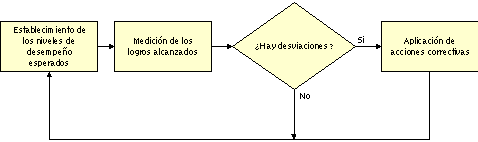
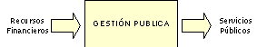
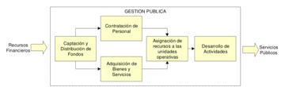
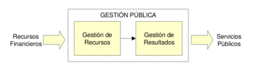
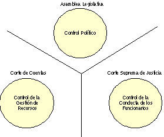

%include: header.inc

# Una Guía al Control de la Gestión Pública en El Salvador

**Jaime Alberto López**  
Equipo Facilitador

A pesar de ser una de las garantías del adecuado funcionamiento de las
instituciones, el control de la gestión pública es un concepto poco claro y
desconocido para muchos. Esta guía presenta información para ayudar a
identificar su naturaleza y comprender su funcionamiento.
Introducción

El control es una función básica de la administración y como tal está presente
en todas las actividades que desarrolla el Estado. En El Salvador, el control de
la gestión pública no es una función claramente definida, aparecen varias normas
e instituciones relacionadas con el control, pero sin un denominador común que
facilite la tarea de identificar su naturaleza y comprender su funcionamiento.

El propósito de este trabajo es ayudar a formarnos una idea sobre lo que es el
control en El Salvador, ya que su conocimiento nos ofrece la base para
comprender muchos de los problemas que afectan a la gestión y el porqué de la
mala calidad de los servicios públicos.

Para desarrollar el tema, en primer lugar, trataremos de construir algunos
conceptos básicos que nos permitirán luego, al hacer un recorrido por nuestra
Constitución, identificar las formas de control existentes. Al final
intentaremos formar una visión integral del control de la gestión pública.
Conceptos Básicos

El primer concepto que debemos definir y delimitar es el de "control" aplicado
al sector gubernamental. Cuando utilizamos el término "control", nos estamos
refiriendo a aquellas acciones que el Gobierno realiza para verificar el uso
correcto de sus recursos y evaluar sus resultados. Por lo tanto, el control
gubernamental es el mecanismo de auto-regulación del Gobierno aplicado sobre sus
instituciones y funcionarios.

El control es un proceso. Se inicia cuando son elaborados los planes y
presupuestos gubernamentales. En ellos, se incluyen niveles de desempeño
esperados.

Conforme los planes se van ejecutando, constantemente se hacen mediciones de los
logros alcanzados. Estas mediciones se comparan con los niveles de desempeño
previamente establecidos y si hay desviaciones, entonces los responsables
establecen y aplican acciones correctivas. En la figura 1 se representa esta
idea.

Hay que destacar que el control asegura el desarrollo continuo de la gestión,
pues sus resultados sirven de insumo para formular los nuevos niveles de
desempeño en los planes futuros. Por esa razón en la figura vemos que el lazo
del proceso se cierra.

Otro concepto importante es el de "gestión pública", a través del cual
representamos la acción del Estado. Para describirla recurriremos al enfoque de
sistemas: las entradas representan los recursos financieros que recibe el
Gobierno y las salidas son los servicios públicos que cada institución
proporciona. La gestión pública es entonces el proceso que transforma los
recursos financieros en los servicios públicos que la Sociedad recibe.

La gestión pública se inicia con la captación de los recursos financieros, que
en su mayor parte provienen de impuestos, préstamos y donaciones. Los recursos
financieros son asignados a cada institución en los términos expresados en sus
respectivos presupuestos.

Las instituciones proceden entonces a contratar personal y adquirir bienes y
servicios, que son asignados a sus dependencias operativas. Los responsables de
las unidades operativas tienen la misión de convertir los recursos humanos y
materiales que les han sido asignados en actividades.

La suma e integración de las actividades desarrolladas por cada una de las
unidades operativas que conforman las instituciones, constituye finalmente los
servicios que son proporcionados a la Sociedad.

Será muy útil dividir la Gestión Pública en dos momentos:

- Gestión de Recursos: La percepción de los recursos financieros, su
distribución, la contratación de personal y la adquisición de recursos.
- Gestión de Resultados: El desarrollo de las actividades y la integración de
sus resultados en servicios.

## Formas de Control

Para determinar las formas de control de la gestión pública existentes en El
Salvador, hemos hecho un recorrido por la Constitución, identificando aquellas
disposiciones relacionadas con aspectos de control. Como resultado hemos
encontrado tres instituciones que tienen entre sus atribuciones principales
desarrollar funciones de control. Estas son:

- Asamblea Legislativa
- Corte de Cuentas de la República
- Corte Suprema de Justicia

A continuación describiremos las funciones de control desarrolladas por estas
instituciones y trataremos de relacionarlas con los conceptos que desarrollamos
anteriormente.

## Asamblea Legislativa

La Asamblea Legislativa es uno de los órganos fundamentales del Estado, por
estar congregados en ella los representantes del "pueblo", es decir, los
diputados. Es el principal organismo de control de la gestión pública, por
corresponderle evaluar la gestión del Órgano Ejecutivo y por depender de ella la
designación de funcionarios de segundo grado como los magistrados de la Corte
Suprema de Justicia, el Fiscal General de la República, los Procuradores General
y de Derechos Humanos y el Presidente y magistrados de la Corte de Cuentas,
principalmente.

Básicamente, la Asamblea Legislativa desarrolla su función de control a través
de la recepción de informes de gestión e investigaciones sobre casos especiales.

### Informes de Labores

El acto de control de la gestión pública de mayor significación es cuando el
Presidente de la República concurre ante la Asamblea Legislativa, para presentar
su informe anual de labores de la "Administración Pública". Luego sus ministros
proceden a presentar el desglose y detalles correspondientes por cada
institución (Arts. 131 numeral 18 y 168 numeral 6 Cn.).

La Asamblea Legislativa puede aprobar o desaprobar el informe que presenta el
Presidente de la República.

En forma similar, presentan informes de su gestión el Fiscal General de la
República, el Procurador General de la República, el Procurador para la Defensa
de los Derechos Humanos, el Presidente de la Corte de Cuentas de la República y
el Presidente del Banco Central de Reserva de El Salvador (art. 131 numeral 36
Cn.).

### Investigación sobre la Gestión Pública

La Asamblea Legislativa puede conformar comisiones especiales de investigación
sobre asuntos de interés nacional, facultad que por supuesto incluye todos los
aspectos relacionados con la gestión pública. Del resultado de esas
investigaciones puede adoptar acuerdos o formular recomendaciones (art. 131
numeral 32 Cn.).

La Asamblea puede hacer uso de sus facultades, como emitir nuevas leyes o
interpelar a los ministros; también puede recomendar su destitución (art. 131
numeral 34 y 37 Cn.).

## Corte de Cuentas de la República

La fiscalización de la Hacienda Pública en general y la ejecución del
Presupuesto en particular corresponden a la Corte de Cuentas de la República
(art. 195 Cn.).

Más adelante la misma Constitución se encarga de definir que es la Hacienda
Pública (art. 223 Cn.), la cual esta conformada por:

- Fondos y valores líquidos
- Créditos activos
- Bienes muebles y raíces
- Derechos derivados de la aplicación de leyes
- Obligaciones a cargo del Estado

También define qué es el Presupuesto: la estimación de todos los ingresos y la
autorización de todas las erogaciones (art. 227 Cn.).

Para cumplir con sus funciones la Corte de Cuentas realiza auditorías y evalúa
los sistemas de control interno, a partir de los cuales puede deducir
responsabilidades administrativas y patrimoniales o informar a la Fiscalía
General de la República para iniciar procesos penales en el caso de la
existencia de delitos.

## Corte Suprema de Justicia

Según la Constitución, los funcionarios y servidores públicos deben cumplir
ciertas normas de conducta. Algunas de estas obligaciones son:

- Ser fieles a la República,
- Cumplir y hacer la Constitución y las leyes;
- Guardar independencia con respecto a los partidos políticos

No existe una normatividad especifica sobre esta materia, ni facultades de
control asignadas a ninguna institución (arts. 218 y 235 Cn.). La excepción es
el control del enriquecimiento ilícito.

La Corte Suprema de Justicia requiere a los funcionarios la presentación de
declaraciones juradas de su patrimonio, al tomar posesión y cesar en sus cargos
(art. 240 Cn.).

Si la diferencia entre las dos declaraciones no corresponde al aumento normal
del capital del funcionario, en razón de los sueldos que haya devengado u otros
ingresos percibidos legalmente, entonces se asume enriquecimiento ilícito y la
Corte Suprema de Justicia puede realizar un juicio para obligar al funcionario a
restituir al Estado lo que hubiera adquirido ilícitamente, sin perjuicio de
otras responsabilidades.

## Una Representación del Control de la Gestión Pública

Ahora para tener una idea completa de lo que es el control de la gestión pública
en El Salvador, trataremos de representar en una sola figura las formas de
control vistas anteriormente.

Al control ejercido por la Asamblea Legislativa le hemos llamado control
político, su evaluación abarca las políticas nacionales de desarrollo y sus
resultados pueden originar cambios en el ordenamiento jurídico o en la
representación del gobierno.

El control de la Corte de Cuentas, por estar enfocado a la Hacienda Pública y la
ejecución del Presupuesto, lo hemos clasificado como Control de la Gestión de
Recursos.

El control ejercido por la Corte Suprema de Justicia lo hemos denominado Control
de la Conducta de los Funcionarios, aunque, como lo vimos anteriormente, está
limitado únicamente a verificar el patrimonio de los funcionarios.

Las líneas que dividen las diferentes formas de control, representadas en la
figura 5, han sido puestas ahí a propósito, para indicar que en la Constitución
no se aprecia una relación claramente definida entre estas áreas de control.
Conclusión

Hemos visto que el control de la gestión pública no es un concepto único y claro
en El Salvador. Lo que existen son áreas de control a cargo de diferentes
instituciones, principalmente la Asamblea Legislativa, la Corte de Cuentas y la
Corte Suprema de Justicia, cada una con un enfoque particular y sin relaciones
preestablecidas entre ellas.

Las formas de control descritas aquí se consideran las principales, sin embargo
existen otras formas de control más particulares o especializadas, así como
otras instituciones encargadas de ejercerlos.

Este trabajo tiene carácter descriptivo, en él se ha tratado de representar un
enfoque general del control de la gestión pública en El Salvador. En posteriores
trabajos trataremos de analizar con mayor detalle los formas de control
mencionadas.

## Referencias

- Corte de Cuentas, Modernización del Estado. Revista Análisis No. 42,
Jun-Jul/95. Universidad Nueva San Salvador.
- Administración una Perspectiva Global. Harold Koontz y Heinz Weihrich. 11a.
Edición. Editorial McGraw Hill, México, 1998.
- Constitución de la República de El Salvador, 1983.

**Sobre el autor:** Salvadoreño. Miembro del Equipo Facilitador de la Revista
Probidad. Trabaja en la Corte de Cuentas. Ha sido Presidente de la Asociación
del Empleados de la Corte de Cuentas/ADECC. Participó en el estudio y en
esfuerzos de "lobby" sobre la "Ley de la Corte de Cuentas" y la "Ley de Sistemas
de Administración Financiera Integrada/SAFI" y en una propuesta de reforma
constitucional a los artículos relacionados con la Corte de Cuentas. Socio y
miembro de la Junta Directiva de la Asociación Probidad (1995-1997).
